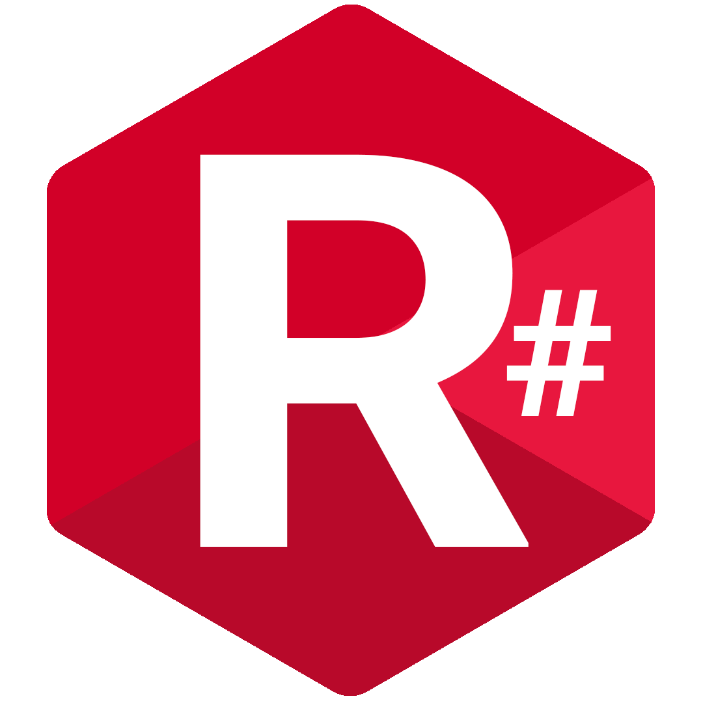
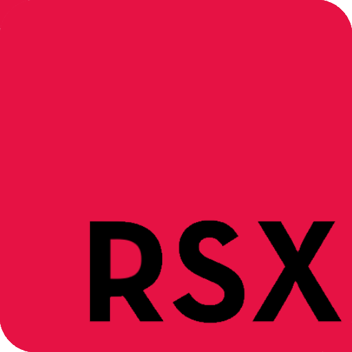

# R# - RSX-R
A compiled statically typed multi paradigm general purpose programming language designed for cross platform applications.

# RSX Logo


# RSX Icon


# Requirements
- Python 3.10 or higher

# Getting Started
## How to install
### Windows (Installs the RSX-R python library)
```
.\install.bat
```

### Linux (Installs the RSX-R python library)
```
./install.sh
```